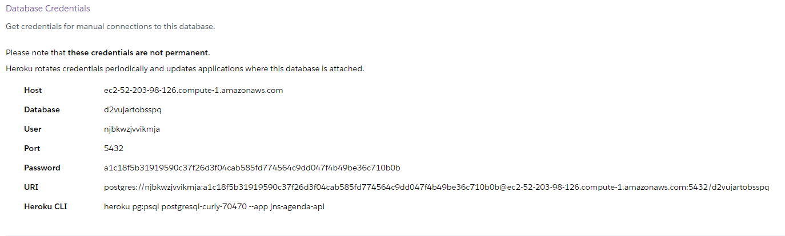

# Clines API

Clines API is the backend of **Caelum Aero linhas**. It allows the customer to buy flight reservations and 
backoffice user to management flights, airport and aircraft.


## Prerequisites
Before you begin, ensure you have met the following requirements:

* Java 11 
* Docker 19+
* Docker Compose 1.25+
* GNU Make 3.8+ 

## Running Clines API

To run this project simply execute this commands inside de project path

```shell script
./mvnw clean package
docker image build --build-arg JAR=target/clines-api-0.0.1-SNAPSHOT.jar -t caelum/clines-api:latest .
docker-compose up
```
## criar container via Dockerfile
```java
docker build -t jnsousa/clines-api .
```

## rodar container docker (Só esse comando falha devido ao banco de dados)
```java
docker run jnsousa/clines-api
```

## Vamos usar o docker compose

Makefile

no terminal execute o comando make <nome da tarefa> no caso `run`
```
make run
```

# Passo a passo deploy no heroku via linha de comando

```
heroku login
```
```
login docker --username=_ --password=$(heroku auth:token)
```
```
heroku create jnsousa-clienes-teste
```
```
heroku addons:create heroku-postgresql:hobby-dev
```
## Configurar variaveis de ambientes
```
heroku config
```
## Exemplo configuração url database postgres no heroku

```
heroku config:set DB_HOST=
```
```
heroku config:set DB_NAME=
```
```
heroku config:set DB_USER=
```
```
heroku config:set DB_PASSWORD=
```

## Realizar alyeração no Dockerfile para aplicação não ultrapassar o limite de memoria e configurar a porta aleatoria

`CMD java -XX:+UseContainerSupport -Xmx512m -jar app.jar --server-port=$PORT`

##Gerar nova imagem Docker no heroku

```
docker build -t jnsousa/clines-api:latest .
```

## Renomear a imagem para padrão do Heroku
```
docker image tag jnsousa/clines-api:latest registry.heroku.com/jnsousa-clines-teste/web:1
```

## Realizar o `push` da imagem para o registry do Heroku
```
docker image push registry.heroku.com/jnsousa-clines-teste/web:1
```
## Comando para pegar id da imagem
```
docker image inspect registry.heroku.com/jnsousa-clines-teste/web:1 -f {{.id}}
```
```
curl -X PATCH \
                    -H "Authorization: Bearer ${heroku auth:token}
                    -H "Content-Type: application.json"
                    -H "Accept:application/vnd.heroku+json; version=3.docker-releases" \
                    -d '{ "updates": [{"type": "web",  "docker_image": "$(IMAGE_ID)"}] }' \
			https://api.heroku.com/apps/jnsousa-clines-teste/formation
```

